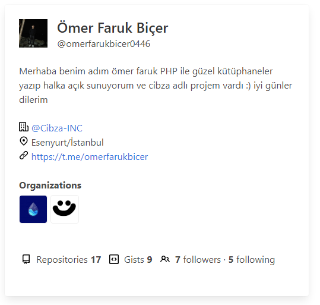

# :octocat: Gapi

>Önemli: **Saatte 60 dan fazla istekte bulunursanız github sizin ipnizi 30 ila 60 dk arası yasaklı tutar.**

Github unoffical api ve içinde çekirdek ve gui diye iki sınıfa ayrılmıştır çekirdek tüm işlemeri yapan kısım gui ise gapinin size sunmuş olduğu güzel gösterimler

## 📥 Kurulum

1. Composer bilgisayarınızda kurulu olması lazımdır.
2. Terminal'e `composer require omerfarukbicer0446/gapi` yazın.
3. Kurulum bitti :) 

## 📒 Kullanım

autoload.php dosyasını require ederek işe başlayın
```php
require "./vendor/autoload.php";
```

API'ye çekirdeği kullanarak bağlanmak isterseniz.

```php
use Gapi\Core\Gapi;

$gapi = new Gapi("omerfarukbicer0446");

/* 
* $gapi->start('functionname') sadece istenilen functionu 
* çalıştırır tabiki bunu $gapi->functionname()  
* şeklindede kullanabilirsiniz. 
* başka profilin bilgilerini çekmek için ikinci 
* parametreye kullanıcı adını yazın.
*/ 

$gapi->all_start(); // Bunu tavsiye etmem sisteminizin hantal ve github'ın size ban atmasını kolaylaştırır sadece kullanacağınız fonksiyonları çalıştırın.

print_r($gapi);

/*
* Kullanabileceğiniz fonksiyonlar:
* 0. __construct() sınıfı başlattığınızda çalışır ne
* çektiğine bakmak için $gapi->detail de saklar çekilen 
* değerleri.
*
* bundan sonra gelen tüm fonksiyonlarda ne çektiğine 
* bakmak için print_r($gapi->functionname) ile içeriğine 
* göz atabilirsiniz.
* 
* not başka bi profilin değerlerini çektiyseniz 
* o değerler $gapi->other_profile_ ön eki ile çekilir 
* sonuna ise fonksiyonun adını yazmanız yeterlidir.
*
* 1. followers()
* 2. following()
* 3. gists()
* 4. starred()
* 5. subscriptions()
* 6. repos()
* 7. events()
*
* Not bu fonksiyonlara boş bir değer gönderdinizmi direk
* api'yi başlattığınız username'yi alır eğer başka bi 
* profili çekmek isterseniz onun username'sini 
* fonksiyonlara göndermeniz lazımdır.
* ör: functionname('username')
*/
```

GUI olarak alma 

```php
use Gapi\Core\Gapi;
use Gapi\Gui\Profile;

$gapi = new Profile("omerfarukbicer0446");

echo $gapi->print;

/*
* Bu kadar bunları yaparsanız profile sınıfına
* atadığınız kullanıcı adının bilgilerini size aynen 
* verir.
*
* Çıktısı aşağıda yer alır.
*/
```

Çıktısı:




## 🌐 Telif Hakkı ve Lisans

* *Copyright (C) 2021 by* [omerfarukbicer0446](https://github.com/omerfarukbicer0446) ❤️️
* [MIT LICENSE](https://github.com/omerfarukbicer0446/gapi/blob/master/LICENSE) *Koşullarına göre lisanslanmıştır..*

## ♻️ İletişim

*Benimle iletişime geçmek isterseniz, **Telegram**'dan mesaj göndermekten çekinmeyin;* [@omerfarukbicer](https://t.me/omerfarukbicer)


> [@omerfarukbicer](https://t.me/omerfarukbicer) tarafından [@smileykanal](https://t.me/smileykanal) için hazırlanmıştır.
